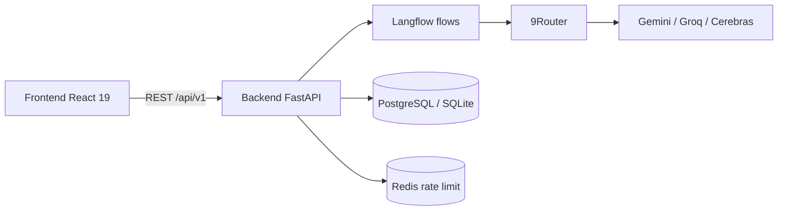

# Timbang — AI Maker-Checker untuk Pengadaan

> AI yang tidak halusinasi. Deteksi fraud pengadaan sebelum pembayaran.

[](https://www.python.org/)
[](https://fastapi.tiangolo.com/)
[](https://react.dev/)
[](https://langflow.org/)
[](#testing)
[](LICENSE)

**Timbang** (Bahasa Indonesia: *menimbang*) adalah sistem AI Maker–Checker untuk deteksi fraud pengadaan di perusahaan menengah Indonesia tanpa ERP. Target submission: IBM SkillsBuild University Education National Hackathon 2026.

---

## Table of Contents

- [Problem Statement](#problem-statement)
- [Solution](#solution)
- [Arsitektur Hybrid 3-Layer](#arsitektur-hybrid-3-layer)
- [Fitur](#fitur)
- [Cara Run](#cara-run)
- [Struktur Folder](#struktur-folder)
- [API Reference](#api-reference)
- [Testing](#testing)
- [Differentiator](#differentiator)
- [Tech Stack](#tech-stack)
- [Security](#security)
- [Roadmap](#roadmap)
- [Team](#team)
- [License](#license)
- [Acknowledgments](#acknowledgments)

---

## Problem Statement

Perusahaan menengah Indonesia kehilangan ~5% revenue/tahun akibat fraud pengadaan ([ACFE 2026](https://www.acfe.com/)). Tanpa ERP, tanpa sistem audit terintegrasi.

Tim purchasing mengelola quote vendor, PO, goods receipt, dan invoice lewat spreadsheet dan email. Blind spot yang sering dieksploitasi:

- **Price inflation** — penawaran di atas harga pasar tanpa benchmarking otomatis
- **Fictitious vendors** — pembayaran ke vendor fiktif tanpa barang
- **Document manipulation** — jumlah invoice diubah setelah barang diterima
- **SOP bypass** — transaksi bernilai tinggi tanpa approval L2

---

## Solution

Timbang mengotomasi kerja auditor pengadaan **sebelum pembayaran disetujui**, dengan keputusan akhir tetap di manusia.

- **Maker Agent** — analisis penawaran + cross-validate harga pasar (Serper / marketplace)
- **Checker Agent** — 4-way matching (PO / GR / Invoice / Faktur Pajak) + SOP + citation guard
- **Human-in-the-loop** — keputusan akhir di staf purchasing, bukan auto-approve

---

## Arsitektur Hybrid 3-Layer

LLM **tidak** menghitung risiko. LLM mengekstrak dan menarasikan. Aturan, angka, dan bukti dijalankan di Python.



Dependensi backend selalu satu arah: `router → service → repository → model`. Modul lain hanya boleh import `public_api.py`.

### Layer 1 — LLM Extraction (`checker_agent`)

Terima PDF PO / GR / Invoice / Faktur Pajak → JSON terstruktur (`reference`, qty, amount, DPP, PPN, NPWP).

Maker memakai flow terpisah: upload PDF penawaran → item, harga vendor, sitasi URL, skor vendor.

### Layer 2 — Deterministic Engine (Python)

| Check | Aturan |
|---|---|
| 4-way matching | Qty ±2%, amount/DPP ±1% (PO vs GR vs Invoice; FP sebagai dokumen ke-4) |
| SOP validation | Transaksi > IDR 100 juta wajib approval L2 |
| Faktur pajak | NPWP 15 digit, PPN ≈ 11% dari DPP, nomor FP 16 digit |
| Citation guard | Temuan tanpa `evidence_url` atau `sop_clause_citation` **dibuang** |
| Fraud labels | 6 tipe indikasi (lihat Checker) |
| Math check | Total penawaran dihitung ulang, tidak percaya angka LLM |

### Layer 3 — LLM Narrative (`risk_narrator`)

Setelah engine selesai, flow narrator (opsional, `LANGFLOW_NARRATOR_FLOW_ID`) mengisi:

- Executive summary
- Pattern analysis
- Dynamic recommendations

Narasi **tidak** mengubah skor atau temuan. Temuan sudah di-persist lewat repository (audit trail yang bisa di-replay).

Diagram C4 dan ADR: [docs/ARCHITECTURE.md](docs/ARCHITECTURE.md).

---

## Fitur

### Maker Agent (`/maker`)

Modul `procurement` — rekomendasi vendor dari PDF penawaran.

- Upload PDF, ekstraksi otomatis via Langflow (`POST /items/recommend-with-file`)
- **Fokus item opsional** — kosongkan untuk *general scan* seluruh dokumen
- Cross-validate harga via Serper API (di flow Langflow)
- Sitasi URL per item (Tokopedia, Shopee, Lazada, dll.)
- Skor vendor 0–100 (`kesimpulan.skor_vendor`)
- Math check deterministik: `OK` / `WARNING` / `CRITICAL` jika total item ≠ total penawaran
- Endpoint legacy: `GET /items/{item_name}/recommend` (tanpa file)

### Checker Agent (`/checker`)

Modul `audit` — matching dokumen + laporan risiko.

- Upload 4 PDF (PO, GR, Invoice, FP) → `POST /transactions/{tx_id}/risk-report-with-files`
- Tab UI: **Upload PDF** | **Input Manual**
- 4-way matching (qty ±2%, amount ±1%)
- SOP validation (threshold L2 100 juta IDR)
- Faktur pajak validation (NPWP, PPN 11%, nomor FP)
- Citation guard
- 6 fraud indication labels:
  - `PRICE_MANIPULATION`
  - `QTY_DISCREPANCY`
  - `SPLIT_PO`
  - `DUPLICATE_INVOICE`
  - `UNAUTHORIZED_APPROVAL`
  - `INCOMPLETE_DOCS`
- Layer 3 narrative (jika narrator flow dikonfigurasi)
- Risk score 0–100 di UI (`/checker/risk-report`) dari severity laporan

Halaman lain: landing `/`, Coming Soon untuk Dashboard, Vendor Management, Findings, About.

---

## Cara Run

### Prerequisites

- Python 3.12+
- Node 20+
- Langflow 1.12 (Maker, Checker, Narrator flows)
- 9Router (gateway multi-LLM)
- Serper API key (untuk sitasi harga pasar di Maker flow)
- PostgreSQL 16 **atau** SQLite untuk dev; Redis opsional (rate limit in-memory di dev)

### Setup

```bash
git clone https://github.com/AgielF/Timbang-Agen-AI-Maker-Checker-untuk-Purchasing-.git
cd Timbang-Agen-AI-Maker-Checker-untuk-Purchasing-

python3 -m venv .venv && source .venv/bin/activate
pip install -e "backend/[dev]"
cd frontend && npm install && cd ..

cp .env.example .env   # isi config — jangan commit .env
cp frontend/.env.example frontend/.env   # VITE_API_BASE_URL

./dev.sh
```

`dev.sh` menjalankan backend `:8000` dan frontend `:5173`.

- Backend health: http://127.0.0.1:8000/health
- Swagger (jika `DEBUG=true`): http://127.0.0.1:8000/docs
- Frontend Maker: http://localhost:5173/maker
- Frontend Checker: http://localhost:5173/checker

Jalankan API saja:

```bash
uvicorn timbang.main:app --reload --app-dir backend/src
```

### Generate sample PDFs

```bash
.venv/bin/python backend/scripts/generate_sample_pdfs.py
```

Output di `sample-docs/` (PO, GR, Invoice, Faktur Pajak) untuk uji upload Checker.

### Environment variables

Salin dari [`.env.example`](.env.example). **Jangan hardcode secret.**

| Variable | Deskripsi |
|---|---|
| `APP_NAME` / `APP_ENV` / `DEBUG` | Identitas runtime; `DEBUG=true` mengaktifkan `/docs` |
| `DATABASE_URL` | SQLAlchemy async (`postgresql+asyncpg://...` atau `sqlite+aiosqlite://...`) |
| `REDIS_URL` | Redis (rate limit production) |
| `JWT_SECRET` | Signing key JWT — string acak panjang |
| `ROUTER_BASE_URL` / `ROUTER_API_KEY` | 9Router |
| `CORS_ORIGINS` | Origin frontend, mis. `http://localhost:5173` |
| `LANGFLOW_BASE_URL` / `LANGFLOW_API_KEY` | Server Langflow |
| `LANGFLOW_MAKER_FLOW_ID` | UUID flow Maker |
| `LANGFLOW_CHECKER_FLOW_ID` | UUID flow ekstraksi 4 PDF |
| `LANGFLOW_NARRATOR_FLOW_ID` | UUID flow Layer 3 (opsional) |
| `LANGFLOW_FILE_NODE_IDS` | JSON mapping node File Langflow (opsional) |
| `LANGFLOW_TIMEOUT_SECONDS` | Timeout HTTP ke Langflow (default 120) |
| `VITE_API_BASE_URL` | Base URL API di `frontend/.env` |

### Seed database (opsional)

```bash
python3 -m timbang.scripts.seed
```

---

## Struktur Folder

Frontend memakai **Atomic Design** (`atoms` → `molecules` → `organisms` → `templates` → `pages`). Backend **modular monolith**: `procurement` (Maker + vendor/quote) dan `audit` (Checker).

```
.
├── .env.example
├── AGENTS.md                 # kontrak AI agent di repo ini
├── LICENSE                   # MIT © 2026 Agiel Fernanda
├── README.md
├── dev.sh                    # backend + frontend
├── backend/
│   ├── pyproject.toml
│   ├── scripts/
│   │   └── generate_sample_pdfs.py
│   ├── tests/                # 63+ pytest
│   └── src/timbang/
│       ├── main.py
│       ├── shared/           # config, middleware, db
│       └── modules/
│           ├── procurement/  # Maker Agent
│           └── audit/        # Checker Agent
├── frontend/
│   └── src/
│       ├── pages/            # Landing, Maker, Checker, RiskReport, …
│       └── components/
│           ├── atoms/
│           ├── molecules/
│           ├── organisms/
│           └── templates/
├── docs/                     # arsitektur, security, frontend, agents
├── langflow/                 # export flow (gitignored)
├── sample-docs/              # PDF contoh (generated)
└── tools/sanitize.sh         # scan secret sebelum commit
```

---

## API Reference

Prefix `/api/v1/` kecuali `/health`.

| Method | Path | Peran |
|---|---|---|
| `GET` | `/health` | Health check |
| `GET` | `/api/v1/procurement/vendors` | Daftar vendor |
| `POST` | `/api/v1/procurement/vendors` | Daftar vendor baru |
| `POST` | `/api/v1/procurement/vendors/{id}/quotes` | Submit quote |
| `GET` | `/api/v1/procurement/items/{item}/validate` | Cross-validate harga (outlier > 30% median) |
| `GET` | `/api/v1/procurement/items/{item}/recommend` | Maker tanpa file |
| `POST` | `/api/v1/procurement/items/recommend-with-file` | **Maker** — PDF + item opsional |
| `POST` | `/api/v1/audit/findings` | Buat temuan |
| `GET` | `/api/v1/audit/findings/{id}` | Baca temuan |
| `POST` | `/api/v1/audit/transactions/{id}/match` | Matching (body PO/GR/Invoice) |
| `POST` | `/api/v1/audit/transactions/{id}/risk-report` | Risk report (input JSON) |
| `POST` | `/api/v1/audit/transactions/{id}/risk-report-with-files` | **Checker** — 4 PDF |

Rate limit per IP (slowapi). Endpoint LLM lebih ketat (`10/min` / `5/min`). Kontrak frontend: [docs/frontend/API_CONTRACT.md](docs/frontend/API_CONTRACT.md).

---

## Testing

```bash
cd backend && pytest -q
```

**Backend: pytest (63+ tests)** — service Maker/Checker, citation guard, SOP, faktur pajak, file upload, Langflow mock, E2E HTTP, rate limit.

```bash
pytest --cov=timbang --cov-report=term-missing -q
```

**Frontend:**

```bash
cd frontend
npm run lint    # oxlint
npm run build
```

**E2E manual:** buka `/checker`, tab Upload PDF, unggah 4 file dari `sample-docs/`, Run, lalu Generate Risk Report.

Lint backend: `ruff check . && black --check .` (dari `backend/`). Sanitasi: `./tools/sanitize.sh`.

---

## Differentiator

1. **Honest AI** — tidak halusinasi angka; math check dan matching di Python
2. **Deterministic + LLM** — auditable (aturan tetap) + narasi kaya (Layer 3)
3. **Citation guard** — temuan tanpa bukti tidak pernah masuk laporan
4. **Layer 3 narrative** — summary eksekutif tanpa mengubah verdict engine
5. **Multi-LLM gateway (9Router)** — Gemini / Groq / Cerebras tanpa lock-in satu provider
6. **Auditable + replayable (AuditChain)** — findings & check results tersimpan, bisa diulang dengan input yang sama

---

## Tech Stack

| Layer | Stack |
|---|---|
| Frontend | React 19, Vite 8, Tailwind 3.4, React Router 6 |
| Backend | FastAPI 0.115+, Pydantic v2, SQLAlchemy 2.0 async, slowapi, structlog |
| Agents | Langflow 1.12, 9Router, Gemini / Groq / Cerebras |
| Data | PostgreSQL 16, Redis, SQLite (dev) |
| PDF | Ekstraksi via Langflow File nodes; sample docs via reportlab |
| Quality | pytest, ruff, black, oxlint |

Modular monolith — bukan microservices. Konfigurasi 12-Factor (semua lewat env).

---

## Security

- Secret hanya dari environment — lihat [docs/SECURITY.md](docs/SECURITY.md)
- `.env`, `*.key`, `mcp.json`, `.bob/` di `.gitignore`
- Rate limit per IP; CORS allowlist; security headers
- Exception domain dipetakan di router — stack trace tidak bocor ke klien
- OWASP API Security Top 10 (2023)

---

## Roadmap

### Done

- Maker + Checker + Layer 3 + arsitektur hybrid 3-layer
- UI Maker (`/maker`) dan Checker (upload + manual)
- Citation guard, SOP L2, validasi faktur pajak, 6 fraud labels
- 63+ backend tests

### Phase 2

- Excel support (`.xlsx`)
- Astra DB vector store untuk SOP clause
- Split PO detection (label sudah ada; deteksi otomatis belum)
- Duplicate invoice detection (label sudah ada; deteksi otomatis belum)
- PDF approval doc export
- MCP Server + Bob Host
- Real-time monitoring (WebSocket)
- Multi-tenant SaaS

---

## Team

**Agiel Fernanda** — Full-stack + AI orchestration

---

## License

MIT © 2026 Agiel Fernanda. Lihat [LICENSE](LICENSE).

---

## Acknowledgments

- IBM SkillsBuild University Education National Hackathon 2026
- Hacktiv8, Langflow, 9Router communities
- ACFE — statistik fraud 2026 yang menjadi motivasi masalah
- FastAPI, Pydantic, SQLAlchemy, ruff, black
